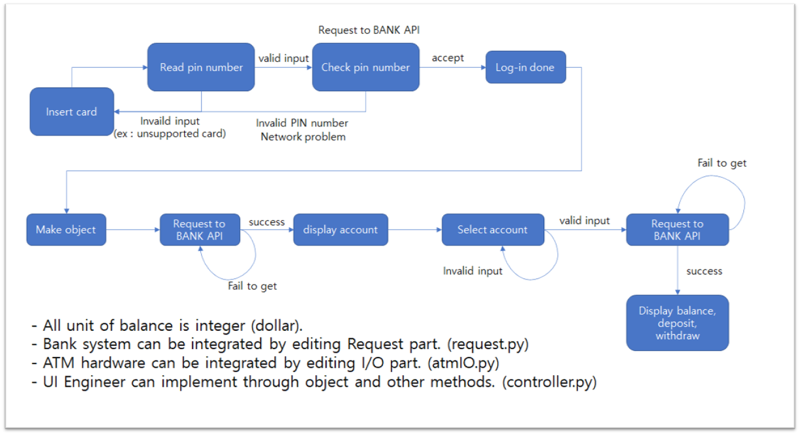

# ATM_controller
code test taks from bear-robotics

## Flows  
1. Insert Card
2. Pin number check
3. Select Account
4. Check Balance/Deposit/Withdraw  

  

## Requirements
- uuid4
- typing
- datetime
- logging
- re

## Test execution
`python controller.py`  

if you want to change test input, please edit test_inputs/.txt files.  
- test_card_input.txt : card input (uuid4 form)
- test_accounts.txt : accounts lits I have ([000-00-000000,...] form)
- test_account_intput.txt : account I select
 (000-00-000000 form)
- test_account_contents.txt : account contents(balance, deposit, withdraws) I have (balance, deposit, withdraws form)  